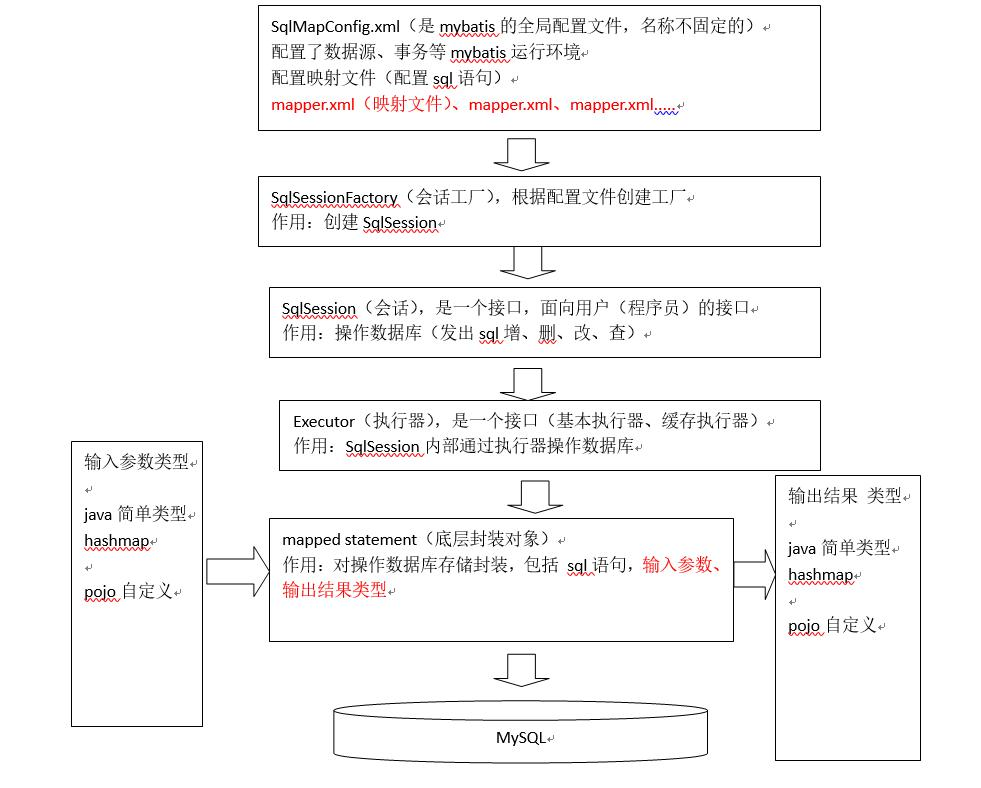
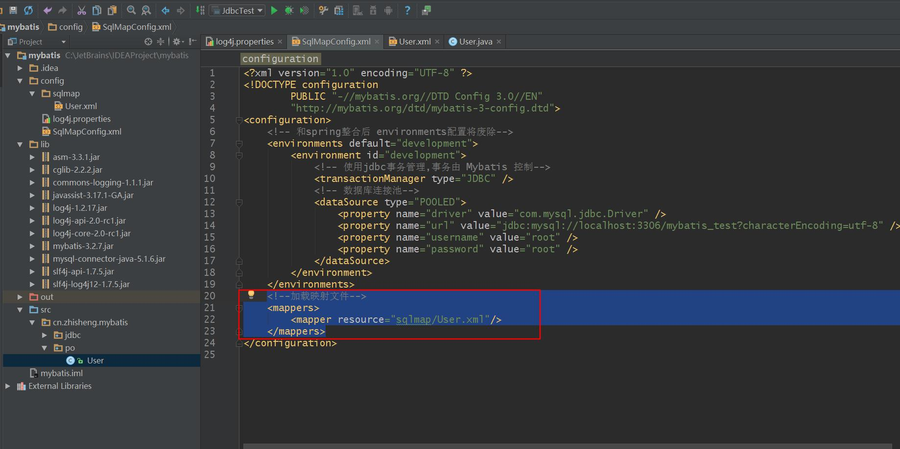

# Mybatis

Mybatis 和 SpringMVC 通过订单商品案例驱动

官方中文地址：http://www.mybatis.org/mybatis-3/zh/

官方托管地址：https://github.com/mybatis/mybatis-3

# 基础知识：

## 对原生态 jdbc 程序（单独使用 jdbc 开发）问题总结

### 1、环境

​		java 环境 ：jdk1.8.0_77

​		开发工具 ： IDEA 2016.1

​		数据库 ： MySQL 5.7

### 2、创建数据库

​		mybatis_test.sql

​		Tables ：items、orderdetail、orders、user

### 3、JDBC 程序

​		使用 JDBC 查询 MySQL 数据库中用户表的记录

​		代码：

```java
package cn.zhisheng.mybatis.jdbc;

/**
 * Created by 10412 on 2016/11/27.
 */

import java.sql.*;

/**
 *通过单独的jdbc程序来总结问题
 */

public class JdbcTest
{
    public static void main(String[] args)
    {
        //数据库连接
        Connection connection = null;
        //预编译的Statement，使用预编译的Statement可以提高数据库性能
        PreparedStatement preparedStatement = null;
        //结果集
        ResultSet resultSet = null;

        try
        {
            //加载数据库驱动
            Class.forName("com.mysql.jdbc.Driver");

            //通过驱动管理类获取数据库链接
            connection =  DriverManager.getConnection("jdbc:mysql://localhost:3306/mybatis_test?characterEncoding=utf-8", "root", "root");
            //定义sql语句 ?表示占位符（在这里表示username）
            String sql = "select * from user where username = ?";
            //获取预处理statement
            preparedStatement = connection.prepareStatement(sql);
            //设置参数，第一个参数为sql语句中参数的序号（从1开始），第二个参数为设置的参数值
            preparedStatement.setString(1, "王五");
            //向数据库发出sql执行查询，查询出结果集
            resultSet =  preparedStatement.executeQuery();
            //遍历查询结果集
            while(resultSet.next())
            {
                System.out.println(resultSet.getString("id")+"  "+resultSet.getString("username"));
            }
        } catch (Exception e) {
            e.printStackTrace();
        }finally{
            //释放资源
            if(resultSet!=null)
            {
                try {
                    resultSet.close();
                } catch (SQLException e) {
                    // TODO Auto-generated catch block
                    e.printStackTrace();
                }
            }
            if(preparedStatement!=null)
            {
                try {
                    preparedStatement.close();
                } catch (SQLException e) {
                    // TODO Auto-generated catch block
                    e.printStackTrace();
                }
            }
            if(connection!=null)
            {
                try {
                    connection.close();
                } catch (SQLException e) {
                    // TODO Auto-generated catch block
                    e.printStackTrace();
                }
            }

        }

    }

}

```


### 4、问题总结

> + 数据库连接，使用时就创建，不使用立即释放，对数据库频繁连接开启和关闭，造成数据库资源的浪费，影响数据库性能。
>
>   解决方法：使用数据库连接池管理数据库连接。
>
> + 将 sql 语句**硬编码**到 java 代码中，如果 sql 语句需要修改，那么就需要重新编译 java 代码，不利于系统的维护。
>
>   设想：将 sql 语句配置在 xml 配置文件中，即使 sql 语句发生变化，也不需要重新编译 java 代码。
>
> + 向 preparedStatement 中设置参数，对占位符号位置和设置参数值，硬编码在 java 代码中，同样也不利于系统的维护。
>
>   设想：将 sql 语句、占位符、参数值配置在 xml 配置文件中。
>
> + 从 resultSet 中遍历结果集数据时，存在硬编码，将获取表的字段进行硬编码，不利于系统维护。
>
>   设想：将查询的结果集自动映射成 java 对象。


## Mybatis框架原理（掌握）

### 1、Mybatis 是什么？

​	Mybatis 是一个持久层的架构，是 appach 下的顶级项目。

​	Mybatis 原先是托管在 googlecode 下，再后来是托管在 Github 上。

​	Mybatis 让程序员将主要的精力放在 sql 上，通过 Mybatis 提供的映射方式，自由灵活生成（半自动，大部分需要程序员编写 sql ）满足需要 sql 语句。

​	Mybatis 可以将向 preparedStatement 中的输入参数自动进行**输入映射**，将查询结果集灵活的映射成 java 对象。（**输出映射**）

### 2、Mybatis 框架



注解：

> + SqlMapConfig.xml （Mybatis的全局配置文件，名称不定）配置了数据源、事务等 Mybatis 运行环境
>
> + Mapper.xml 映射文件（配置 sql 语句）
>
> + SqlSessionFactory （会话工厂）根据配置文件配置工厂、创建 SqlSession
>
> + SqlSession （会话）面向用户的接口、操作数据库（发出 sql 增删改查）
>
> + Executor （执行器）是一个接口（基本执行器、缓存执行器）、SqlSession 内部通过执行器操作数据库
>
> + Mapped Statement （底层封装对象）对操作数据库存储封装，包括 sql 语句、输入参数、输出结果类型
 ​


## Mybatis入门程序

### 1、需求

    用户的增删改查

### 2、环境
    
    java 环境 ：jdk1.8.0_77
    
    开发工具 ： IDEA 2016.1
    
    数据库 ： MySQL 5.7
    
    Mybatis 运行环境（ jar 包）
    
    MySQL 驱动包
    
    其他依赖包

### 3、 log4j.properties

在classpath下创建log4j.properties如下：

```properties
# Global logging configuration
#在开发环境日志级别要设置为DEBUG、生产环境要设置为INFO或者ERROR
log4j.rootLogger=DEBUG, stdout
# Console output...
log4j.appender.stdout=org.apache.log4j.ConsoleAppender
log4j.appender.stdout.layout=org.apache.log4j.PatternLayout
log4j.appender.stdout.layout.ConversionPattern=%5p [%t] - %m%n

```

Mybatis默认使用log4j作为输出日志信息。


### 4、工程结构


### 5、SqlMapConfig.xml

配置 Mybatis 的运行环境、数据源、事务等

```xml
<?xml version="1.0" encoding="UTF-8" ?>
<!DOCTYPE configuration
        PUBLIC "-//mybatis.org//DTD Config 3.0//EN"
        "http://mybatis.org/dtd/mybatis-3-config.dtd">
<configuration>
    <!-- 和spring整合后 environments配置将废除-->
    <environments default="development">
        <environment id="development">
            <!-- 使用jdbc事务管理,事务由 Mybatis 控制-->
            <transactionManager type="JDBC" />
            <!-- 数据库连接池,由Mybatis管理，数据库名是mybatis_test，Mysql用户名root，密码root -->
            <dataSource type="POOLED">
                <property name="driver" value="com.mysql.jdbc.Driver" />
                <property name="url" value="jdbc:mysql://localhost:3306/mybatis_test?characterEncoding=utf-8" />
                <property name="username" value="root" />
                <property name="password" value="root" />
            </dataSource>
        </environment>
    </environments>
</configuration>
```


### 6、创建 po 类 

Po类作为mybatis进行sql映射使用，po类通常与数据库表对应，User.java如下：

```java
package cn.zhisheng.mybatis.po;

import java.util.Date;

/**
 * Created by 10412 on 2016/11/28.
 */
public class User
{
    private int id;
    private String username;            // 用户姓名
    private String sex;                 // 性别
    private Date birthday;              // 生日
    private String address;             // 地址

    //getter and setter

    public int getId() {
        return id;
    }

    public void setId(int id) {
        this.id = id;
    }

    public String getUsername() {
        return username;
    }

    public void setUsername(String username) {
        this.username = username;
    }

    public Date getBirthday() {
        return birthday;
    }

    public void setBirthday(Date birthday) {
        this.birthday = birthday;
    }

    public String getSex() {
        return sex;
    }

    public void setSex(String sex) {
        this.sex = sex;
    }

    public String getAddress() {
        return address;
    }

    public void setAddress(String address) {
        this.address = address;
    }
}
```


### 7、根据用户 id（）主键查询用户信息

+  映射文件

   > + User.xml（原在 Ibatis 中命名）在 Mybatis 中命名规则为 xxxmapper.xml
   > + 在映射文件中配置 sql 语句

   `User.xml`

   ```xml
   <?xml version="1.0" encoding="UTF-8" ?>
   <!DOCTYPE mapper
   PUBLIC "-//mybatis.org//DTD Mapper 3.0//EN"
   "http://mybatis.org/dtd/mybatis-3-mapper.dtd">
   <mapper namespace="test">
   </mapper>
   ```

   `namespace` ：命名空间，对 sql 进行分类化管理，用于隔离 sql 语句，后面会讲另一层非常重要的作用。

   ​

   在 `User.xml` 中加入

   ```xml
   <!--通过select执行数据库查询
           id:标识映射文件中的sql
           将sql语句封装到mappedStatement对象中，所以id称为Statement的id
           #{}：表示占位符
           #{id}：其中的id表示接收输入的参数，参数名称就是id，如果输入参数是简单类型，那么#{}中的参数名可以任意，可以是value或者其他名称
           parameterType：表示指定输入参数的类型
           resultType：表示指定sql输出结果的所映射的java对象类型
    -->
   <!-- 根据id获取用户信息 -->
       <select id="findUserById" parameterType="int" resultType="cn.zhisheng.mybatis.po.User">
           select * from user where id = #{id}
       </select>
   ```

   `User.xml` 映射文件已经完全写好了，那接下来就需要在 `SqlMapConfig.xml`中加载映射文件 `User.xml`

   ```xml
   <!--加载映射文件-->
       <mappers>
           <mapper resource="sqlmap/User.xml"/>
       </mappers>
   ```

   

+  编写程序

   `MybatisFirst.java`

   ```java
   package cn.zhisheng.mybatis.first;

   import cn.zhisheng.mybatis.po.User;
   import org.apache.ibatis.io.Resources;
   import org.apache.ibatis.session.SqlSession;
   import org.apache.ibatis.session.SqlSessionFactory;
   import org.apache.ibatis.session.SqlSessionFactoryBuilder;
   import org.junit.Test;

   import java.io.IOException;
   import java.io.InputStream;

   /**
   * Created by 10412 on 2016/11/28.
   */
   public class MybatisFirst
   {
      //根据id查询用户信息，得到用户的一条记录
      @Test
      public void findUserByIdTest() throws IOException
      {
          //Mybatis 配置文件
          String resource = "SqlMapConfig.xml";

          //得到配置文件流
          InputStream inputStream = Resources.getResourceAsStream(resource);

          //创建会话工厂,传入Mybatis的配置文件信息
          SqlSessionFactory  sqlSessionFactory = new SqlSessionFactoryBuilder().build(inputStream);
            //通过工厂得到SqlSession
         SqlSession sqlSession = sqlSessionFactory.openSession();

         //通过SqlSession操作数据库
         //第一个参数：映射文件中Statement的id，等于 = namespace + "." + Statement的id
         //第二个参数：指定和映射文件中所匹配的parameterType类型的参数
         //sqlSession.selectOne 结果与映射文件中所匹配的resultType类型的对象
         User user = sqlSession.selectOne("namespace.findUserById", 1);

         System.out.println(user);

         //释放资源
         sqlSession.close();
     }
   }
   ```


 Mybatis 开发 dao 两种方法

+ 原始 dao 开发方法（程序需要编写 dao 接口和 dao 实现类）（掌握）
+ Mybatis 的 mapper 接口（相当于 dao 接口）代理开发方法（掌握）

Mybatis 配置文件 SqlMapConfig.xml

Mybatis 核心：

> + Mybatis 输入映射（掌握）
> + Mybatis 输出映射（掌握）

Mybatis 的动态 sql（掌握）


# 高级知识：

订单商品数据模型分析

高级结果集映射（一对一、一对多、多对多）

Mybatis 延迟加载

Mybatis 查询缓存（一级缓存、二级缓存）

Mybatis 和 Spring 进行整合（掌握）

Mybatis 逆向工程

