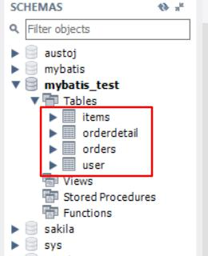
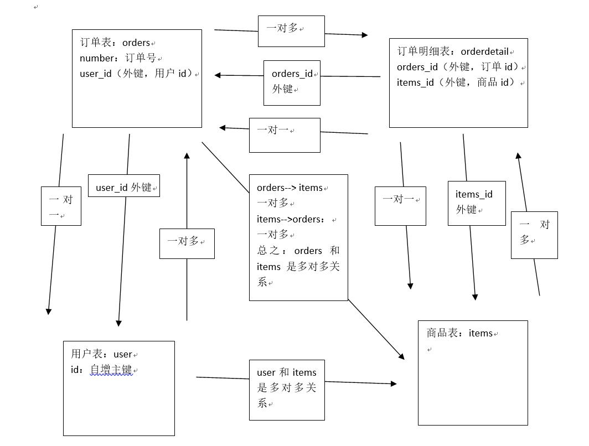
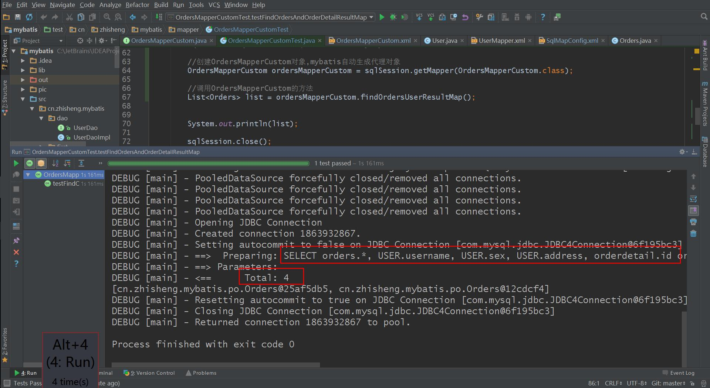

## Mybatis 高级知识

安排：对订单商品数据模型进行分析

1、高级映射：

+ 实现一对一查询、一对多、多对多查询
+ 延迟加载

2、查询缓存：

+ 一级缓存
+ 二级缓存

3、Mybatis 和 Spring 整合

4、逆向工程


## 1、订单商品数据模型



### 数据模型分析思路：

1、每张表记录的数据内容（分模块对每张表记录的内容进行熟悉，相当于学习系统需求的过程）

2、每张表重要的的字段设置（非空字段、外键字段）

3、数据库级别表与表之间的关系（外键关系）

4、表与表业务之间的关系（要建立在每个业务意义的基础上去分析）

### 数据模型分析模型

+ 用户表 user：记录购买商品的用户信息
+ 订单表 order：记录用户所创建的订单(购买商品的订单)
+ 订单明细表 orderdetail：（记录了订单的详细信息即购买商品的信息）
+ 商品表 items：记录了商品信息

**表与表业务之间的关系**：

在分析表与表之间的业务关系时需要建立在某个业务意义基础上去分析。

先分析数据级别之间有关系的表之间的业务关系：

1、**usre和orders**：

user ---> orders：一个用户可以创建多个订单，一对多

orders  ---> user：一个订单只由一个用户创建，一对一

2、 **orders和orderdetail**：

orders  --->  orderdetail：一个订单可以包括 多个订单明细，因为一个订单可以购买多个商品，每个商品的购买信息在orderdetail记录，一对多关系

 orderdetail  --->  orders：一个订单明细只能包括在一个订单中，一对一

3、 **orderdetail 和 itesm**：

orderdetail --->  itesms：一个订单明细只对应一个商品信息，一对一

 items  --->   orderdetail:一个商品可以包括在多个订单明细 ，一对多

 再分析数据库级别没有关系的表之间是否有业务关系：

4、 **orders 和 items**：

orders 和 items 之间可以通过 orderdetail 表建立 关系。




## 2、一对一查询

### 需求：

查询订单信息，关联查询创建订单的用户信息

### 使用 resultType

+ sql 语句

  确定查询的主表：订单表

  确定查询的关联表：用户表

  关联查询使用内链接？还是外链接？

  由于orders表中有一个外键（user_id），通过外键关联查询用户表只能查询出一条记录，可以使用内链接。

  ```sql
  SELECT orders.*, USER.username, USER.sex, USER.address FROM orders, USER WHERE orders.user_id = user.id
  ```

+ 创建 pojo

  `Orders.java`

  ```java
  public class Orders {
      private Integer id;
      private Integer userId;
      private String number;
      private Date createtime;
      private String note;
      //用户信息
      private User user;
      //订单明细
      private List<Orderdetail> orderdetails;
      //getter and setter
  }
  ```

  `OrderCustom.java`

  ```java
  //通过此类映射订单和用户查询的结果，让此类继承包括 字段较多的pojo类
  public class OrdersCustom extends Orders{
  	//添加用户属性
  	/*USER.username,
  	  USER.sex,
  	  USER.address */
  	private String username;
  	private String sex;
  	private String address;
  	//getter and setter	
  }
  ```

+ 映射文件 

  `OrdersMapperCustom.xml`

  ```xml
  <!--查询订单关联查询用户信息-->
      <select id="findOrdersUser" resultType="cn.zhisheng.mybatis.po.OrdersCustom">
          SELECT orders.*, USER.username, USER.sex, USER.address FROM orders, USER WHERE orders.user_id = user.id
      </select>
  ```

+ Mapper 文件

  `OrdersMapperCustom.java`

  ```java
  public interface OrdersMapperCustom
  {
      public OrdersCustom findOrdersUser() throws Exception;
  }
  ```

+ 测试代码（记得在 SqlConfig.xml中添加载 OrdersMapperCustom.xml 文件）

  ```java
   @Test
      public void testFindOrdersUser() throws Exception
      {
          SqlSession sqlSession = sqlSessionFactory.openSession();
          //创建OrdersMapperCustom对象,mybatis自动生成代理对象
          OrdersMapperCustom ordersMapperCustom = sqlSession.getMapper(OrdersMapperCustom.class);
          //调用OrdersMapperCustom的方法
           List<OrdersCustom> list = ordersMapperCustom.findOrdersUser();
          System.out.println(list);
          sqlSession.close();
      }
  ```

+ 测试结果

  

  ​

  ​


### 使用 resultMap

+ sql 语句（和上面的一致）

+ 使用 resultMap 映射思路

  使用 resultMap 将查询结果中的订单信息映射到 Orders 对象中，在 orders 类中添加 User 属性，将关联查询出来的用户信息映射到 orders 对象中的 user 属性中。 

  ```java
   //用户信息
   private User user;
  ```

+ 映射文件

  `OrdersMapperCustom.xml`

  先定义 resultMap

  ```xml
  <!--定义查询订单关联查询用户信息的resultMap
          将整个查询结果映射到cn.zhisheng.mybatis.po.Orders
      -->
      <resultMap id="OrdersUserResultMap" type="cn.zhisheng.mybatis.po.Orders">
          <!--配置映射的订单信息-->
          <!--id表示查询结果中的唯一标识  在这里是订单的唯一标识  如果是由多列组成的唯一标识，那么就需要配置多个id
          column：id 是订单信息中的唯一标识列
          property：id 是订单信息唯一标识列所映射到orders中的id属性
          最终resultMap对column和property做一个映射关系（对应关系）
          -->
          <id column="id" property="id"/>
          <result column="user_id" property="userId"/>
          <result column="number" property="number"/>
          <result column="createtime" property="createtime"/>
          <result column="note" property="note"/>

          <!--配置映射的关联用户信息
              association 用于映射关联查询单个对象的信息
              property  将要关联查询的用户信息映射到 orders中的属性中去
          -->
          <association property="user" javaType="cn.zhisheng.mybatis.po.User">
              <!--id 关联用户信息的唯一标识
                  column: 指定唯一标识用户的信息
                  property：映射到user的那个属性
              -->
              <id column="user_id" property="id"/>
              <result column="username" property="username"/>
              <result column="sex" property="sex"/>
              <result column="address" property="address"/>
              <result column="birthday" property="birthday"/>
          </association>
      </resultMap>
  ```

  ```xml
  <!--查询订单关联查询用户信息, 使用 resultMap-->
      <select id="findOrdersUserResultMap" resultMap="OrdersUserResultMap">
          SELECT orders.*, USER.username, USER.sex, USER.address FROM orders, USER WHERE orders.user_id = user.id
      </select>
  ```

+ Mapper 文件

  ```java
   public List<Orders> findOrdersUserResultMap() throws Exception;
  ```

+ 测试代码

  ```java
   @Test
      public void testFindOrdersUserResultMap() throws Exception
      {
          SqlSession sqlSession = sqlSessionFactory.openSession();
          //创建OrdersMapperCustom对象,mybatis自动生成代理对象
          OrdersMapperCustom ordersMapperCustom = sqlSession.getMapper(OrdersMapperCustom.class);
          //调用OrdersMapperCustom的方法
          List<Orders> list = ordersMapperCustom.findOrdersUserResultMap();
          System.out.println(list);
          sqlSession.close();
      }
  ```

+ 测试结果

  


### 使用 resultType 和 resultMap 一对一查询小结

+ resultType：使用resultType实现较为简单，如果pojo中没有包括查询出来的列名，需要增加列名对应的属性，即可完成映射。如果没有查询结果的特殊要求建议使用resultType。
+ resultMap：需要单独定义resultMap，实现有点麻烦，如果对查询结果有特殊的要求，使用resultMap可以完成将关联查询映射pojo的属性中。resultMap可以实现延迟加载，resultType无法实现延迟加载。


## 一对多查询

**需求**：查询订单及订单明细信息

**SQL语句**：

确定主查询表：订单表

确定关联查询表：订单明细表

在一对一查询基础上添加订单明细表关联即可。

```sql
SELECT orders.*, USER.username, USER.sex, USER.address, orderdetail.id orderdetail_id, orderdetail.items_id, orderdetail.items_num, orderdetail.orders_id FROM orders, USER,
orderdetail WHERE orders.user_id = user.id AND orderdetail.orders_id=orders.id
```

分析：

使用 resultType 将上边的查询结果映射到 pojo 中，订单信息的就是重复。

要求：

> 对 orders 映射不能出现重复记录。

在 orders.java 类中添加 List<orderDetail> orderDetails 属性。

最终会将订单信息映射到 orders 中，订单所对应的订单明细映射到 orders 中的 orderDetails 属性中。

映射成的 orders 记录数为两条（orders信息不重复）

每个 orders 中的 orderDetails 属性存储了该订单所对应的订单明细。

**映射文件**：

首先定义 resultMap

```xml
<!--定义查询订单及订单明细信息的resultMap使用extends继承，不用在中配置订单信息和用户信息的映射-->
    <resultMap id="OrdersAndOrderDetailResultMap" type="cn.zhisheng.mybatis.po.Orders" extends="OrdersUserResultMap">
        <!-- 订单信息 -->
        <!-- 用户信息 -->
        <!-- 使用extends继承，不用在中配置订单信息和用户信息的映射 -->
        <!-- 订单明细信息
        一个订单关联查询出了多条明细，要使用collection进行映射
        collection：对关联查询到多条记录映射到集合对象中
        property：将关联查询到多条记录映射到cn.zhisheng.mybatis.po.Orders哪个属性
        ofType：指定映射到list集合属性中pojo的类型
         -->
        <collection property="orderdetails" ofType="cn.zhisheng.mybatis.po.Orderdetail">
        <!-- id：订单明细唯 一标识
   property:要将订单明细的唯 一标识 映射到cn.zhisheng.mybatis.po.Orderdetail的哪个属性-->
            <id column="orderdetail_id" property="id"/>
            <result column="items_id" property="itemsId"/>
            <result column="items_num" property="itemsNum"/>
            <result column="orders_id" property="ordersId"/>
        </collection>
    </resultMap>
```

```xml
 <!--查询订单及订单明细信息, 使用 resultMap-->
    <select id="findOrdersAndOrderDetailResultMap" resultMap="OrdersAndOrderDetailResultMap">
        SELECT orders.*, USER.username, USER.sex, USER.address, orderdetail.id orderdetail_id, orderdetail.items_id, orderdetail.items_num, orderdetail.orders_id
        FROM orders, USER,orderdetail WHERE orders.user_id = user.id AND orderdetail.orders_id=orders.id
    </select>
```

**Mapper 文件**

```java
public List<Orders> findOrdersAndOrderDetailResultMap() throws Exception;
```

**测试文件**

```java
@Test
    public void testFindOrdersAndOrderDetailResultMap() throws Exception
    {
        SqlSession sqlSession = sqlSessionFactory.openSession();
        //创建OrdersMapperCustom对象,mybatis自动生成代理对象
        OrdersMapperCustom ordersMapperCustom = sqlSession.getMapper(OrdersMapperCustom.class);
        //调用OrdersMapperCustom的方法
        List<Orders> list = ordersMapperCustom.findOrdersAndOrderDetailResultMap();
        System.out.println(list);
        sqlSession.close();
    }
```

**测试结果**



### 总结：

mybatis使用resultMap的collection对关联查询的多条记录映射到一个list集合属性中。 

使用resultType实现：将订单明细映射到orders中的orderdetails中，需要自己处理，使用双重循环遍历，去掉重复记录，将订单明细放在orderdetails中。


